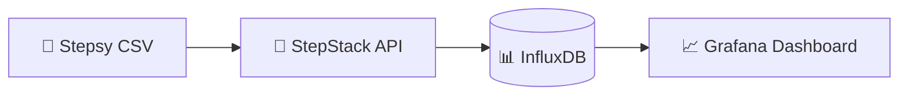
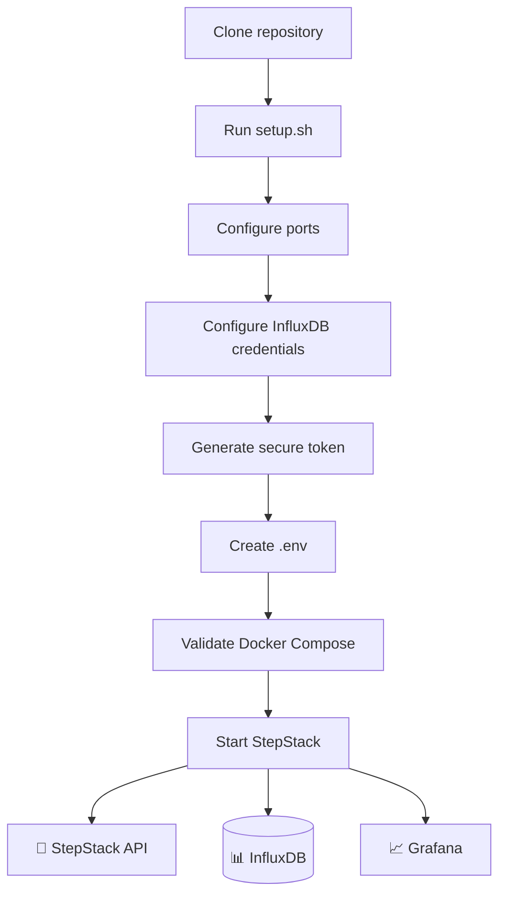
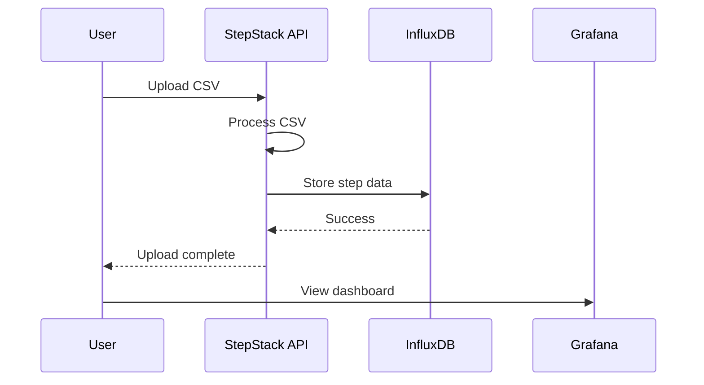
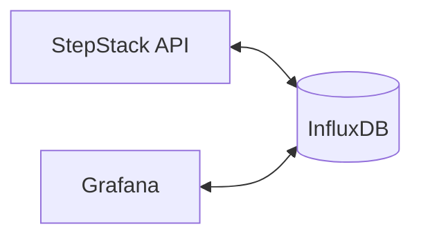
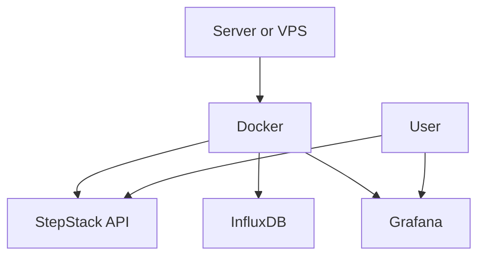

# StepStack

A simple self-hosted step tracking stack.

Upload your walking data as a CSV file, store it in InfluxDB, and visualize it with Grafana.

> **Important:** StepStack is designed to import CSV files exported from **Stepsy**.
> You can also use CSV files from another source, provided they follow the required format:
>
> ```text
> YYYY-MM-DD,STEP_COUNT
> ```
>
> Example:
>
> ```csv
> 2026-04-18,6032
> 2026-04-19,8450
> 2026-04-20,10461
> ```

```text
CSV → StepStack API → InfluxDB → Grafana
```


---

## Architecture



StepStack consists of three services:

* **StepStack API** — accepts and imports CSV step data
* **InfluxDB** — stores the step data
* **Grafana** — visualizes the data

---

## Requirements

Before starting, make sure you have:

* Docker Engine
* Docker Compose

Verify your installation:

```bash
docker --version
docker compose version
```

---

# Quick Start

Clone the repository:

```bash
git clone git@github.com:nikoswu/stepstack.git
cd stepstack
```

Run the setup wizard:

```bash
./setup.sh
```

The setup wizard will:

* Check that Docker is installed
* Check that Docker Compose is available
* Ask you to choose the StepStack API port
* Ask you to choose the Grafana port
* Ask for an InfluxDB username
* Ask for an InfluxDB password
* Generate a secure InfluxDB token
* Create your local `.env` configuration
* Validate the Docker Compose configuration
* Optionally start the complete stack

Your `.env` file contains local credentials and is ignored by Git.

---

## Installation Flow



---

# Accessing StepStack

The ports are chosen during setup.

If you selected:

```text
API_PORT=5555
GRAFANA_PORT=3333
```

you can access the services using:

### StepStack upload page

```text
http://localhost:5555/upload-form
```

### API health check

```text
http://localhost:5555/health
```

### Grafana

```text
http://localhost:3333
```

For a remote server, replace `localhost` with your server IP or domain:

```text
http://SERVER_IP:API_PORT/upload-form
```

or:

```text
https://steps.example.com/upload-form
```

when using a reverse proxy and HTTPS.

---

# Upload Step Data

Open the StepStack upload page:

```text
http://SERVER_IP:API_PORT/upload-form
```

Select a CSV file exported from Stepsy.

The CSV format should be:

```text
YYYY-MM-DD,STEP_COUNT
```

Example:

```csv
2026-04-18,6032
2026-04-19,69
2026-04-20,10461
```

After a successful upload:

1. The CSV data is processed by the StepStack API.
2. The step data is stored in InfluxDB.
3. The upload page confirms how many data points were imported.
4. A button appears that opens your Grafana dashboard.



---

# Docker Services

StepStack runs three Docker containers:

```text
stepstack-api
stepstack-influxdb
stepstack-grafana
```

The services communicate through an internal Docker network:



InfluxDB and Grafana data are stored in persistent Docker volumes:

```text
influxdb_data
grafana_data
```

Your data remains available when containers are restarted or recreated.

---

# Useful Commands

## Check running containers

```bash
docker compose ps
```

## View container logs

```bash
docker compose logs
```

Follow logs in real time:

```bash
docker compose logs -f
```

View logs for a specific service:

```bash
docker compose logs -f stepstack-api
```

## Restart the stack

```bash
docker compose restart
```

## Rebuild and start

```bash
docker compose up -d --build
```

## Stop the stack

```bash
docker compose down
```

Stopping the stack does **not** delete your InfluxDB or Grafana data.

---

# Updating StepStack

Pull the latest version:

```bash
git pull
```

Rebuild and restart the stack:

```bash
docker compose up -d --build
```

---

# Configuration

The setup wizard creates a local `.env` file.

Example:

```env
# InfluxDB initial setup
INFLUX_USERNAME=stepstack
INFLUX_PASSWORD=your_secure_password
INFLUX_TOKEN=automatically_generated_secure_token

# Application ports
API_PORT=5000
GRAFANA_PORT=3000
```

You normally do not need to edit this file manually.

If you change the ports later, restart the stack:

```bash
docker compose up -d --build
```

---

# Advanced Manual Setup

If you prefer not to use the setup wizard, create the environment file manually:

```bash
cp .env.example .env
```

Edit it:

```bash
nano .env
```

Then start StepStack:

```bash
docker compose up -d --build
```

Make sure that:

* The InfluxDB password is between 8 and 72 characters.
* The API and Grafana ports are valid and not already in use.
* The InfluxDB token is long and randomly generated.

---

# Security

The `.env` file contains local configuration and credentials.

It is excluded from Git using `.gitignore`:

```text
.env
```

**Never commit your `.env` file to GitHub.**

The `.env.example` file contains only example values and is safe to keep in the repository.

For internet-facing deployments, it is recommended to use:

* A reverse proxy
* HTTPS
* Authentication where appropriate

---

# Remove All Data

> ⚠️ **Warning:** This permanently deletes all stored InfluxDB and Grafana data.

Run:

```bash
docker compose down -v
```

This removes the containers and Docker volumes.

---

# Development

Install the development dependencies:

```bash
pip install -r requirements-dev.txt
```

Run the test suite:

```bash
pytest
```

---

# Project Structure

```text
stepstack-api/
├── .github/                 GitHub Actions workflows
├── grafana/
│   ├── dashboards/          StepStack dashboard definitions
│   └── provisioning/        Grafana provisioning
├── stepstack/
│   └── app/
│       ├── app.py           Flask application
│       ├── Dockerfile
│       └── templates/
│           └── upload.html  CSV upload interface
├── tests/
├── docker-compose.yaml
├── setup.sh
├── .env.example
└── README.md
```

---

# Deployment

StepStack is designed to run as a self-hosted Docker Compose stack.



For a public deployment, you can place StepStack behind a reverse proxy and use your own domain:

```text
https://steps.example.com
        │
        ▼
Reverse Proxy
        │
        ├── StepStack API
        │
        └── Grafana
```

---

## License

This project is currently provided as a personal self-hosted project.

You can add a license file later depending on how you want others to use, modify, and distribute the project.
