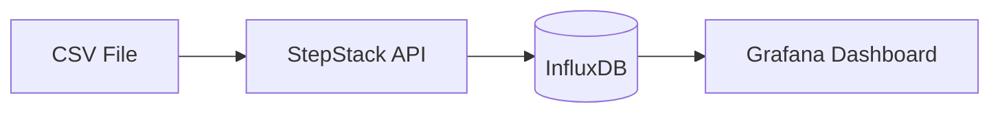
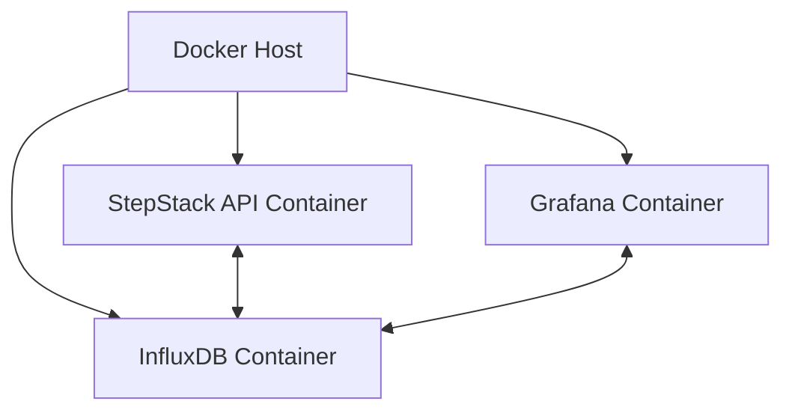
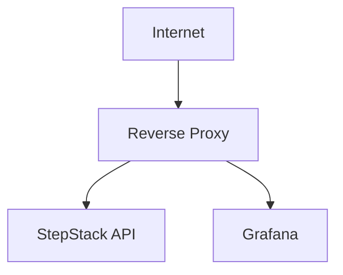
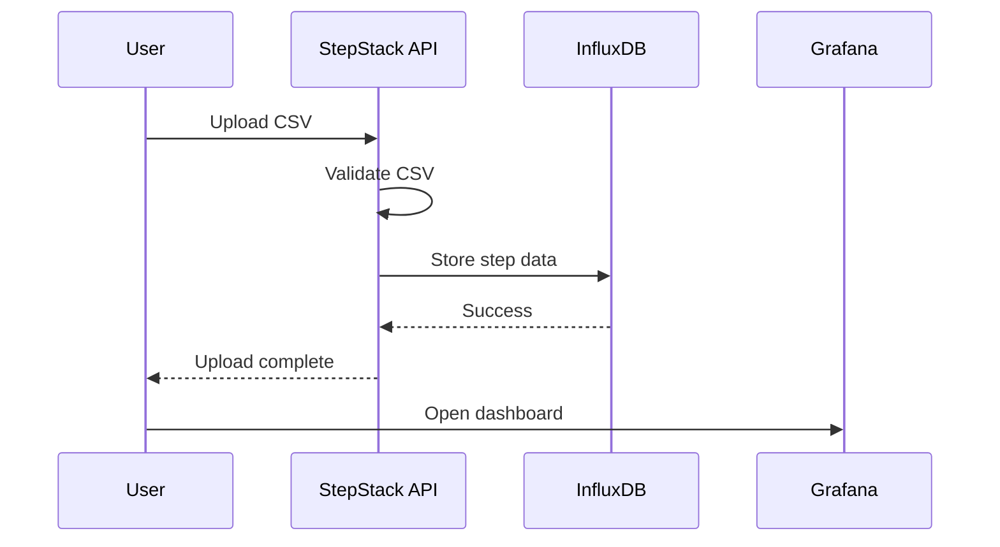
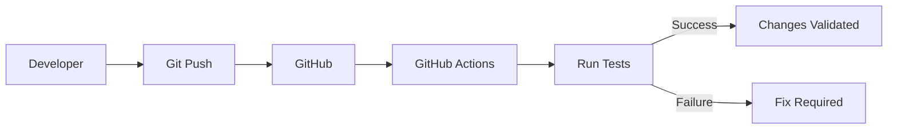
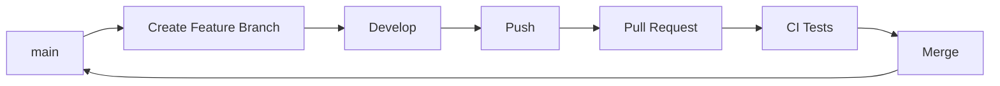
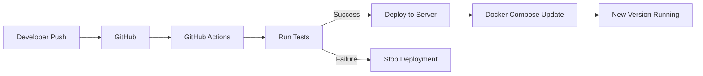
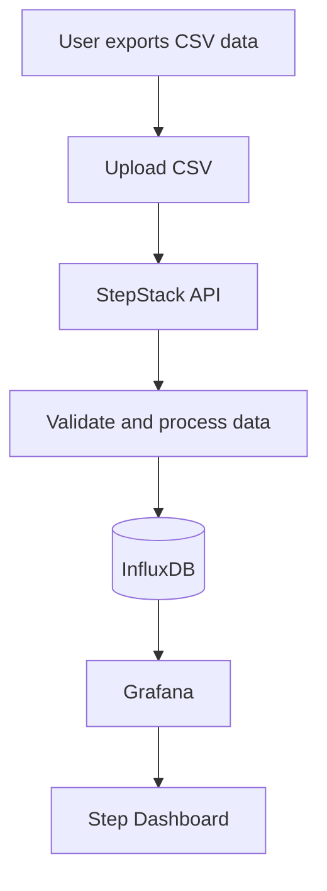

# StepStack Technical Guide

## Overview

StepStack is a self-hosted application designed to store and visualize daily step data.

The application accepts walking data in CSV format, processes the data through a small web application, stores it in InfluxDB, and visualizes it through Grafana.

The complete architecture is:

```text
CSV File
   │
   ▼
StepStack API
   │
   ▼
InfluxDB
   │
   ▼
Grafana Dashboard
```

StepStack is designed to run entirely with Docker Compose.

This means that the user does not need to install Python, InfluxDB, or Grafana directly on the host system.

Docker handles the application environment and runs each component inside its own container.

---

# 1. Architecture

StepStack consists of three main services.



The services are:

1. **StepStack API**
2. **InfluxDB**
3. **Grafana**

Each service runs inside a separate Docker container.

---

## StepStack API

The StepStack API is the application component responsible for importing CSV files.

It provides a simple web interface where the user can upload a CSV file containing daily step data.

Example:

```csv
2026-04-18,6032
2026-04-19,8450
2026-04-20,10461
```

The expected format is:

```text
YYYY-MM-DD,STEP_COUNT
```

When a CSV file is uploaded, the API:

1. Receives the file.
2. Reads each row.
3. Validates the date and step count.
4. Converts the data into InfluxDB points.
5. Sends the data to InfluxDB.
6. Returns a result to the user.

The API also provides a health endpoint.

Example:

```text
/health
```

This can be used to verify that the application is running correctly.

---

# 2. InfluxDB

InfluxDB is used as the application's time-series database.

Step data is naturally time-based because every step count belongs to a specific date.

For example:

```text
2026-04-18 → 6032 steps
2026-04-19 → 8450 steps
2026-04-20 → 10461 steps
```

InfluxDB stores this information efficiently and allows Grafana to query it later.

The StepStack configuration creates:

```text
Organization: stepstack
Bucket: steps
```

The API connects internally to InfluxDB using Docker networking.

The API does not need to know the host IP address.

Instead, it connects using the Docker service name:

```text
http://influxdb:8086
```

Docker automatically resolves the service name inside the StepStack network.

---

# 3. Grafana

Grafana is responsible for visualizing the stored step data.

StepStack includes Grafana provisioning files and dashboard definitions.

When the stack starts, Grafana automatically receives:

* The InfluxDB data source configuration.
* The required InfluxDB connection information.
* The StepStack dashboard.

This means that the user does not need to manually create the data source or build the dashboard.

The dashboard is automatically available after the containers start.

---

## Initial Grafana Login

The default Grafana credentials are:

```text
Username: admin
Password: admin
```

Grafana will normally ask the user to change the password after the first login.

For production or public deployments, the default credentials should not be kept.

---

# 4. Docker Architecture

The application runs using Docker Compose.

The main configuration file is:

```text
docker-compose.yaml
```

Docker Compose defines the three services:

```text
stepstack-api
stepstack-influxdb
stepstack-grafana
```

The architecture looks like this:



The containers communicate through an internal Docker network.

```text
stepstack_network
```

This network allows the containers to communicate with each other without exposing internal services directly.

---

# 5. Persistent Data

StepStack uses Docker volumes to store persistent data.

The two main volumes are:

```text
stepstack_influxdb_data
stepstack_grafana_data
```

These volumes store:

### InfluxDB

```text
Step data
Database configuration
InfluxDB metadata
```

### Grafana

```text
Grafana users
Grafana configuration
Dashboard state
```

Because the data is stored in Docker volumes, it remains available when containers are restarted or recreated.

For example:

```bash
docker compose down
docker compose up -d
```

does not delete the stored data.

To permanently remove all application data, the volumes must also be removed.

```bash
docker compose down -v
```

This command should be used carefully because it permanently deletes the StepStack database and Grafana data.

---

# 6. Installation Requirements

Before installing StepStack, the host system needs:

```text
Docker Engine
Docker Compose
Git
```

These can be verified with:

```bash
docker --version
```

```bash
docker compose version
```

```bash
git --version
```

The application itself does not require a local Python installation because the Python application runs inside a Docker container.

---

# 7. Cloning the Repository

The StepStack repository contains the complete application.

Clone the repository:

```bash
git clone git@github.com:nikoswu/StepStack.git
```

Move into the project directory:

```bash
cd StepStack
```

The project structure should look similar to this:

```text
StepStack/
├── .github/
├── grafana/
├── stepstack/
├── tests/
├── docker-compose.yaml
├── setup.sh
├── .env.example
├── requirements-dev.txt
└── README.md
```

---

# 8. The Setup Script

The easiest way to install StepStack is by using:

```bash
./setup.sh
```

If the script does not have execute permissions:

```bash
chmod +x setup.sh
```

Then run it:

```bash
./setup.sh
```

The setup script acts as an installation wizard.

It performs several checks and configuration steps automatically.

---

# 9. What the Setup Script Does

The setup process:

1. Checks that Docker is installed.
2. Checks that Docker Compose is available.
3. Checks whether the selected ports are available.
4. Asks the user to choose an API port.
5. Asks the user to choose a Grafana port.
6. Requests an InfluxDB username.
7. Requests an InfluxDB password.
8. Generates a secure InfluxDB token.
9. Creates the local `.env` file.
10. Validates the Docker Compose configuration.
11. Optionally starts the StepStack stack.

The generated `.env` file contains the local configuration.

Example:

```env
INFLUX_USERNAME=stepstack
INFLUX_PASSWORD=your_secure_password
INFLUX_TOKEN=automatically_generated_secure_token

API_PORT=5000
GRAFANA_PORT=3000
```

This file is ignored by Git.

---

# 10. Why the `.env` File Is Not Stored in GitHub

The `.env` file contains sensitive configuration.

This may include:

```text
InfluxDB username
InfluxDB password
InfluxDB token
Local port configuration
```

For this reason, `.env` is included in `.gitignore`.

Example:

```text
.env
```

This prevents Git from tracking the file.

Instead, the repository contains:

```text
.env.example
```

The example file contains placeholders only.

For example:

```env
INFLUX_USERNAME=stepstack
INFLUX_PASSWORD=your_secure_password
INFLUX_TOKEN=generate_a_secure_token

API_PORT=5000
GRAFANA_PORT=3000
```

A user creates their own `.env` file during installation.

This means that every deployment has its own credentials.

---

# 11. Port Configuration

StepStack uses two externally accessible application ports.

These are:

```text
StepStack API
Grafana
```

The ports are configured using environment variables.

Example:

```env
API_PORT=5000
GRAFANA_PORT=3000
```

The actual container ports remain:

```text
API → 5000
Grafana → 3000
```

The host ports can be changed.

For example:

```env
API_PORT=5555
GRAFANA_PORT=3333
```

The services would then be available locally at:

```text
http://localhost:5555
```

and:

```text
http://localhost:3333
```

---

# 12. Localhost Binding

By default, StepStack binds the API and Grafana ports to:

```text
127.0.0.1
```

This means that the services are only accessible from the same server.

The architecture is:

```text
Internet
   │
   ✖ Direct access blocked
   │
Server
   │
   ├── 127.0.0.1:API_PORT
   │
   └── 127.0.0.1:GRAFANA_PORT
```

This prevents Docker from exposing the application ports directly to the internet.

The ports are still accessible locally on the server.

For example:

```text
http://localhost:5000/upload-form
```

and:

```text
http://localhost:3000
```

This is especially useful when StepStack is deployed on a VPS.

---

# 13. External Access Using a Reverse Proxy

If the user wants to access StepStack from the internet, the recommended approach is to use a reverse proxy.

Example:



The reverse proxy can handle:

```text
HTTPS
SSL certificates
Domain routing
Authentication
```

For example:

```text
https://steps.example.com
```

can forward traffic to:

```text
http://127.0.0.1:5000
```

Grafana can be exposed through another domain or subdomain:

```text
https://grafana.example.com
```

which forwards traffic to:

```text
http://127.0.0.1:3000
```

This approach avoids directly exposing Docker application ports to the internet.

---

# 14. Starting StepStack

After the configuration is complete, start the application with:

```bash
docker compose up -d --build
```

Docker Compose will:

1. Build the StepStack API image.
2. Download the required InfluxDB image.
3. Download the required Grafana image.
4. Create the Docker network.
5. Create the persistent volumes.
6. Start all containers.

Check the running containers:

```bash
docker compose ps
```

Expected services:

```text
stepstack-api
stepstack-influxdb
stepstack-grafana
```

---

# 15. Checking Application Health

The StepStack API provides a health endpoint.

From the server:

```bash
curl http://localhost:5000/health
```

If a custom port was selected:

```bash
curl http://localhost:YOUR_API_PORT/health
```

The response confirms that the API is running.

Docker container status can also be checked with:

```bash
docker compose ps
```

---

# 16. Uploading Step Data

Open the StepStack upload page:

```text
http://localhost:API_PORT/upload-form
```

For example:

```text
http://localhost:5000/upload-form
```

Select a CSV file containing step data.

Example:

```csv
2026-04-18,6032
2026-04-19,8450
2026-04-20,10461
```

The data flow is:



After a successful upload, the data becomes available in InfluxDB and can be visualized through Grafana.

---

# 17. Accessing Grafana

Grafana is available locally at:

```text
http://localhost:GRAFANA_PORT
```

For example:

```text
http://localhost:3000
```

The initial login credentials are:

```text
Username: admin
Password: admin
```

After logging in, Grafana may request a password change.

The StepStack dashboard should already be available because it is provisioned automatically.

---

# 18. Updating StepStack

The application can be updated using Git.

First, move into the StepStack directory:

```bash
cd StepStack
```

Pull the latest version:

```bash
git pull
```

Then rebuild and restart the containers:

```bash
docker compose up -d --build
```

Docker will rebuild the StepStack API if application files have changed.

The existing Docker volumes are preserved.

This means that existing:

```text
Step data
InfluxDB configuration
Grafana data
```

will remain available.

---

# 19. Viewing Logs

To view logs from all services:

```bash
docker compose logs
```

To follow the logs in real time:

```bash
docker compose logs -f
```

To view logs for the API only:

```bash
docker compose logs -f stepstack-api
```

InfluxDB logs:

```bash
docker compose logs -f influxdb
```

Grafana logs:

```bash
docker compose logs -f grafana
```

These commands are useful when troubleshooting startup or connectivity problems.

---

# 20. Restarting Services

Restart all services:

```bash
docker compose restart
```

Restart a specific service:

```bash
docker compose restart stepstack-api
```

Rebuild the application and start the stack:

```bash
docker compose up -d --build
```

Stop the application:

```bash
docker compose down
```

Stopping the containers does not delete the persistent data.

---

# 21. Removing the Application

To stop and remove the containers:

```bash
docker compose down
```

The data remains stored in Docker volumes.

To completely remove the containers and all StepStack data:

```bash
docker compose down -v
```

This permanently removes:

```text
InfluxDB data
Grafana data
```

The project files themselves are not deleted.

---

# 22. Development Environment

The production application does not require a local Python environment.

However, the repository includes development dependencies.

These are stored in:

```text
requirements-dev.txt
```

A Python virtual environment can be created for development:

```bash
python3 -m venv .venv
```

Activate it:

```bash
source .venv/bin/activate
```

Install the development dependencies:

```bash
pip install -r requirements-dev.txt
```

Run the tests:

```bash
pytest
```

The `.venv` directory is ignored by Git.

This is because it contains locally installed Python packages and should not be stored in the repository.

The structure is:

```text
Developer Machine
│
├── Source Code
├── .venv
│   └── Local Python environment
│
└── Git Repository
```

The `.venv` folder is not required when running StepStack with Docker.

---

# 23. Continuous Integration

The repository uses GitHub Actions for Continuous Integration.

The CI workflow runs automatically when changes are pushed or when pull requests are created.

The workflow can perform checks such as:

```text
Install dependencies
Run tests
Validate the application
```

The general flow is:



This helps detect problems before changes are merged into the main branch.

---

# 24. Git Workflow

A typical development workflow can use feature branches.

Example:

```bash
git checkout -b feature/new-feature
```

Make changes.

Check the current status:

```bash
git status
```

Add the modified files:

```bash
git add .
```

Create a commit:

```bash
git commit -m "Add new feature"
```

Push the branch:

```bash
git push -u origin feature/new-feature
```

A Pull Request can then be created on GitHub.

The Pull Request can trigger the CI workflow.

After the tests pass, the branch can be merged into:

```text
main
```

The workflow becomes:



---

# 25. Continuous Deployment

StepStack currently focuses on Continuous Integration.

Continuous Deployment can be added later.

A possible deployment workflow would be:



For a VPS deployment, GitHub Actions could connect to the server and execute:

```bash
git pull
docker compose up -d --build
```

However, this requires secure authentication between GitHub and the server.

For example:

```text
GitHub Actions
        │
        │ SSH
        ▼
VPS
        │
        ├── git pull
        │
        └── docker compose up -d --build
```

This is a possible future improvement for the StepStack project.

---

# 26. Security Considerations

StepStack includes several basic security decisions.

### Secrets are not stored in Git

The `.env` file is excluded using:

```text
.gitignore
```

Sensitive values should never be committed to GitHub.

### Application ports are bound to localhost

The API and Grafana are configured to listen on:

```text
127.0.0.1
```

This prevents direct internet exposure.

### Reverse proxy recommended

External access should be handled through a reverse proxy.

The reverse proxy can provide:

```text
HTTPS
SSL certificates
Authentication
Domain routing
```

### Persistent data is separated

Application data is stored in Docker volumes rather than inside the containers.

This makes the application easier to restart, update, and maintain.

---

# 27. Complete System Flow

The complete StepStack workflow is:



From installation to daily usage:

```text
1. Clone StepStack
        ↓
2. Run setup.sh
        ↓
3. Configure ports and credentials
        ↓
4. Start Docker Compose stack
        ↓
5. Open StepStack upload page
        ↓
6. Upload CSV
        ↓
7. Data stored in InfluxDB
        ↓
8. Open Grafana
        ↓
9. View step statistics
```

---

# Conclusion

StepStack is a self-contained Docker Compose application for importing and visualizing step data.

The project combines several technologies:

```text
GitHub
Git
Docker
Docker Compose
Python
Flask
InfluxDB
Grafana
GitHub Actions
```

The application is designed so that a user can clone the repository, run the setup script, configure their local environment, and start the complete stack without manually installing or configuring InfluxDB or Grafana.

The main architecture is:

```text
CSV
 ↓
StepStack API
 ↓
InfluxDB
 ↓
Grafana
```

The use of Docker Compose provides a reproducible deployment environment, while Git and GitHub provide source control and CI automation.

The current setup also follows a safer deployment model by binding application ports to localhost and recommending a reverse proxy for external access.

This makes StepStack suitable as a self-hosted project that can run on a local machine, home server, or VPS.

